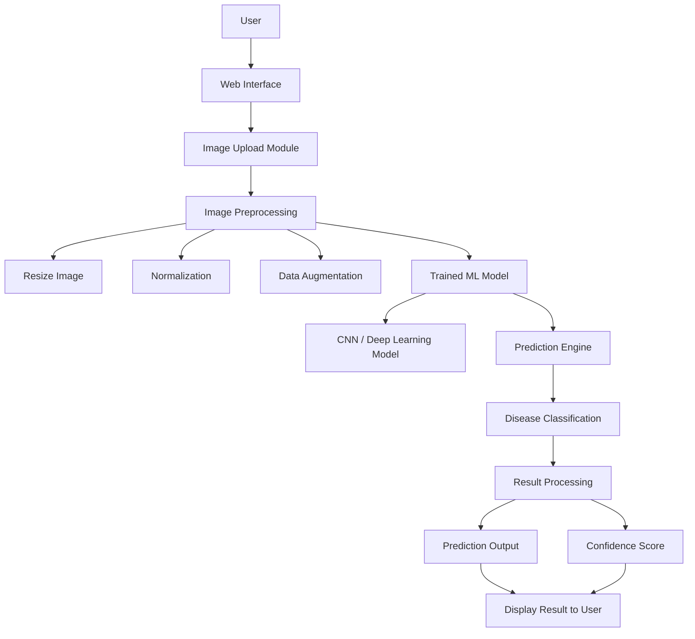

🩺 AI-Based Disease Prediction System
An end-to-end **Machine Learning + FastAPI** powered Disease Prediction Web Application that predicts diseases from medical images using Deep Learning.

This project demonstrates the **complete ML lifecycle** — from dataset preparation and model training to API deployment and frontend integration — making it suitable for **internships and entry-level ML/AI roles**.

________________________________________
📌 Project Overview
Early and accurate disease detection plays a crucial role in modern healthcare.
This project focuses on building an AI-driven disease prediction system that:
•	Takes medical images as input
•	Applies image preprocessing & augmentation
•	Uses deep learning models for disease classification
•	Provides predictions through a web-based interface
The system is designed to be scalable, modular, and easy to understand, even for beginners in Machine Learning.
________________________________________
🚀 Features
•	🧠 Multiple Deep Learning models
  • Chest X-ray Disease Detection
  • Malaria Detection
  • Ocular Disease Detection
• 🖼️ Image preprocessing (resize, normalization, grayscale handling)
• ⚡ FastAPI backend with REST API
• 📄 Interactive API docs (Swagger UI)
• 🌐 Simple frontend (HTML + JavaScript)
• 📊 Confidence-based prediction output
• 🔌 Modular and scalable architecture
________________________________________
🛠️ Tech Stack
### Machine Learning & AI
- Python
- TensorFlow / Keras
- NumPy
- Pandas
- Scikit-learn
- Pillow (PIL)

### Backend
- FastAPI
- Uvicorn

### Frontend
- HTML
- CSS
- JavaScript
- Live Server (VS Code)

### Tools
- Git & GitHub
- VS Code
- Virtual Environment (venv)
________________________________________
📁 Dataset Description
The project uses medical image datasets (such as ocular/skin disease datasets) sourced from Kaggle.
Dataset Organization Strategy
•	Images are resized to a fixed dimension
•	Preprocessed images are stored in structured class folders
•	For multi-label disease cases, images are duplicated into all relevant disease folders
•	Separate directories for:
o	Training data
o	Testing data
📌 This approach improves model clarity, training efficiency, and reproducibility.
________________________________________
🔄 Workflow Architecture
1. Dataset Collection
2. Image Preprocessing
•	Resizing
•	Normalization
•	Noise removal
3. Dataset Structuring
4. Model Training
5. Model Evaluation
6. Web Application Integration
7. Prediction Output
________________________________________
________________________________________
🧠 Model Architecture
•	Convolutional Neural Network (CNN)
•	Layers:
o	Convolution + ReLU
o	Max Pooling
o	Fully Connected Layers
•	Loss Function: Categorical Cross-Entropy
•	Optimizer: Adam
The model is trained to learn visual patterns in medical images and classify them into disease categories.
________________________________________
📊 Model Evaluation
•	Accuracy
•	Loss curves
•	Validation performance
•	Confusion matrix (optional)
Evaluation ensures the model generalizes well on unseen medical images.
________________________________________
## 🧠 System Architecture


________________________________________

📂 Project Structure
Disease_Prediction/
│
├── model/
│ ├── cxr_model.h5
│ ├── malaria_model.keras
│ ├── ocular_model.keras
│ └── cardio_scaler.joblib
│
├── frontend/
│ └── index.html
│
├── combined_dataset_cxr/
├── combined_dataset_malaria/
├── combined_dataset_ocular/
│
├── main.py
├── requirements.txt.txt
├── README.md
└── version.py
________________________________________
## ⚙️ How to Run Locally

### 1️⃣ Clone the repository
```bash
git clone https://github.com/itsRajbro/Disease_Prediction.git
cd Disease_Prediction
### 2️⃣ Install Dependencies
```bash
pip install -r requirements.txt

________________________________________
🎯 Learning Outcomes
•	End-to-end ML project development
•	Medical image handling & preprocessing
•	CNN-based image classification
•   FastAPI backend development
•   REST API integration
•	Frontend–backend communication
•	Model deployment workflow
________________________________________
🔮 Future Improvements
•	🔹 Add more disease classes
•	🔹 Improve accuracy with transfer learning (ResNet, EfficientNet)
•	🔹 Add authentication system and user history
•	🔹 Deploy on cloud (AWS / Render / HuggingFace Spaces)
•	🔹 Add explainability (Grad-CAM)
________________________________________
👨‍💻 Author
Ayush Raj
2nd Year B.Tech (AIML) Student
KIET Group of Institutions, Ghaziabad
🔗 GitHub: https://github.com/itsRajbro
🔗 LinkedIn: https://www.linkedin.com/in/ayush-raj-7650a9325
________________________________________
⭐ If you find this project helpful
Please ⭐ star this repository — it helps and motivates me to build more ML projects!

